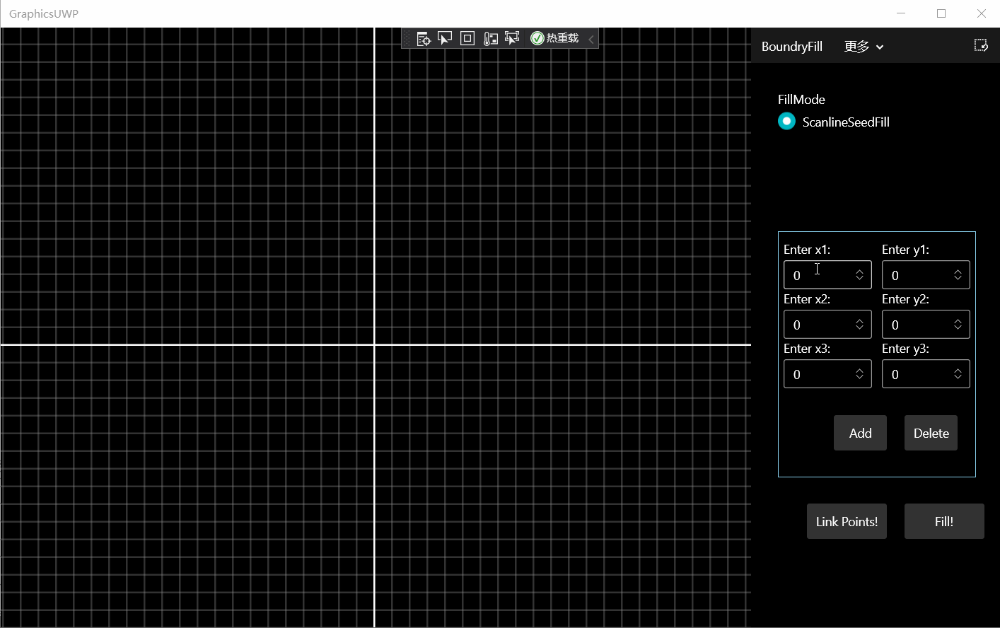

# ComputerGraphicsUWP

CQU软件学院 计算机图形学实验

---
1. 绘制直线
    - DDA
    - Bresenham  
    
2. 绘制圆/椭圆
    - MidPoint
    - Bresenham  
    
3. 区域填充
    - ScanLineSeedFill  
    
4. 直线裁剪
    - CohenSutherlandLineClipping 

---

